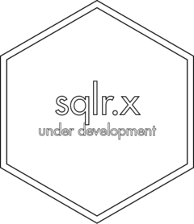

<!-- README.md is generated from README.Rmd. Please edit that file -->

```{r, include = FALSE}
knitr::opts_chunk$set(
  collapse = TRUE,
  comment = "#>",
  fig.path = "man/figures/README-",
  out.width = "100%"
)

library(sqlr.template)
```

# sqlr.template <a href='https://gipsousp.github.io/sqlr.template'></a>

<!-- badges: start -->
[](https://www.repostatus.org/#wip)
[](https://lifecycle.r-lib.org/articles/stages.html#experimental)
[](https://github.com/gipsousp/sqlr.template/actions)
[](https://travis-ci.com/gipsousp/sqlr.template)
[](https://codecov.io/gh/gipsousp/sqlr.template?branch=main)
[](https://choosealicense.com/licenses/mit/)
[](https://gipsousp.github.io/mctq/CODE_OF_CONDUCT.html)
<!-- badges: end -->

> This is a template repository for R packages of the GIPSO Systematic Quantitative Literature Reviews. If you're looking for a specific review repository, check the [GIPSO GitHub page](https://github.com/gipsousp).

`sqlr.[INSERT THE NAME OF THE PACKAGE]` is an R package with the research compendium of the project: `[INSERT THE NAME OF THE PROJECT]`. The aim of `sqlr.[INSERT THE NAME OF THE PACKAGE]` is to facilitate research work, in addition to contributing to the reproducibility of the research.

The assemble of this package was inspired by Ben Marwick, Carl Boettiger & Lincoln Mullen article ["Packaging Data Analytical Work Reproducibly Using R (and Friends)"](https://doi.org/10.1080/00031305.2017.1375986).

Learn more about systematic quantitative literature reviews at <http://bit.ly/2OMxvcD>.

## Installation

`sqlr.[INSERT THE NAME OF THE PACKAGE]` is still at the [experimental](https://lifecycle.r-lib.org/articles/stages.html#experimental) stage of development, that means that people can use the package and provide feedback, but it comes with no promises for long term stability.

You can install `sqlr.[INSERT THE NAME OF THE PACKAGE]` from GitHub with:

``` {r, eval = FALSE}
# install.packages("sqlr.[INSERT THE NAME OF THE PACKAGE]")
devtools::install_github("gipsousp/sqlr.[INSERT THE NAME OF THE PACKAGE]", dependencies = TRUE)
```

## Citation

If you use `sqlr.[INSERT THE NAME OF THE PACKAGE]` in your research, please consider citing it. We put a lot of work to build and maintain a free and open-source R package. You can find the `sqlr.[INSERT THE NAME OF THE PACKAGE]` citation below.

```{r}
citation("sqlr.template")
```
